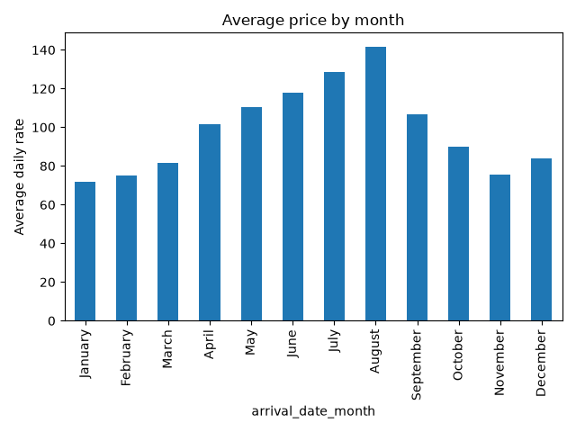
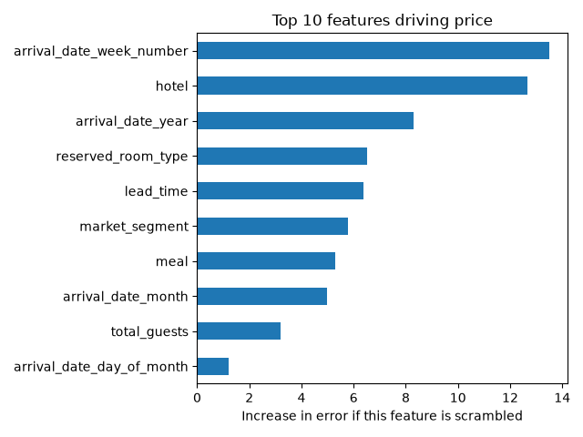

# Hotel Price Prediction

Predicts the average daily rate (ADR) of a hotel booking using machine learning.

## Dataset
[Hotel Booking Demand](https://www.kaggle.com/datasets/jessemostipak/hotel-booking-demand) from Kaggle: over 119,000 bookings for a city hotel and a resort hotel in Portugal (2015 to 2017).

## What I did
1. Cleaned the data by removing zero or negative prices and extreme outliers (ADR above 1000).
2. Engineered features such as total nights and total guests.
3. Removed columns that leak the answer, such as `reservation_status`.
4. Trained a Ridge regression baseline and a Gradient Boosting model.
5. Used permutation importance to find what drives price.

## Results
| Model | Avg error (MAE) | R2 |
|---|---|---|
| Ridge (baseline) | 20.98 | 0.637 |
| Gradient Boosting | 10.38 | 0.890 |

Gradient Boosting cut the average error roughly in half compared to the baseline.

## Key findings
- Prices peak in August (about 142) and are lowest in January (about 72).
- Week of year, hotel type, and booking year are the strongest price drivers.

## Limitations
- The train/test split is random, and the data has many near-duplicate bookings, so the R2 is probably a bit optimistic.
- The model learned a price trend across 2015 to 2017, so it may not predict future years well.

## How to run
1. Download `hotel_bookings.csv` from Kaggle into this folder.
2. `pip install pandas numpy matplotlib scikit-learn joblib`
3. `python train_model.py`